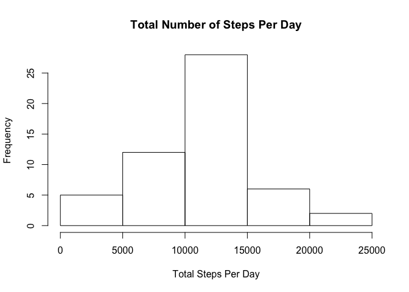

# Reproducible Research: Peer Assessment 1


## Loading and preprocessing the data

```r
raw_data <- read.csv("activity.csv")
good <- complete.cases(raw_data)
proc_data <- raw_data[good,]
```

## What is mean total number of steps taken per day?

####Calculating the total number of steps taken per day


```r
TotalStepPerDay <- aggregate(proc_data[,1],list("Date" = proc_data$date),sum)
names(TotalStepPerDay) <- c("Date","TotalSteps")
```

####A histogram of the total number of steps taken each day

```r
hist(TotalStepPerDay$TotalSteps, xlab = "Total Steps Per Day", main ="Total Number of Steps Per Day")
```

 

####Mean and Median of Total Number of Steps Per Day


```r
MeanTotalSteps <- mean(TotalStepPerDay$TotalSteps)
MedianTotalSteps <- median(TotalStepPerDay$TotalSteps)
```

The mean total number of steps per day is 1.0766189\times 10^{4}
The median total number of steps per day is 10765


## What is the average daily activity pattern?


####A time series plot of the 5-minute interval (x-axis) and the average number of steps taken, averaged across all days (y-axis)


```r
avg_5m_interval <- aggregate(proc_data[,1],list("interval" = proc_data$interval),mean)
names(avg_5m_interval) <- c("interval","avg_steps")

plot(avg_5m_interval$interval,avg_5m_interval$avg_steps, type = "l", ylab = "Average Number of Steps", xlab = "5 Minute Intervals", main = "Time series of steps against the 5-minute interval")
```

 

Calculating the maximum average number of steps in the 5 minute interval


```r
max_interval <- avg_5m_interval[avg_5m_interval[,2] == max(avg_5m_interval$avg_steps),][,1]
```

The 5-minute interval, on average across all the days in the dataset, that contains the maximum number of steps is 835


## Imputing missing values

####Calculating the total number of NAs


```r
good <- complete.cases(raw_data)
na_data <- raw_data[!good,]
na_rows <- nrow(na_data)
```

Total number of rows with NAs is 2304

####Using the mean for the 5-minute interval to replace the NA and Creating a new dataset that is equal to the original dataset but with the missing data filled in.


```r
proc_na_data <- merge(x=na_data,y=avg_5m_interval,intersect = "interval",all.x=FALSE)[,c(4,3,1)]
names(proc_na_data) <- c("steps","date","interval")
comb_data <- rbind(proc_data,proc_na_data)
```

####Calculating the total number of steps taken per day for the new data set


```r
TotalStepPerDay_new <- aggregate(comb_data[,1],list("Date" = comb_data$date),sum)
names(TotalStepPerDay_new) <- c("Date","TotalSteps")
```

####A histogram of the total number of steps taken each day for the new data set

```r
hist(TotalStepPerDay_new$TotalSteps, xlab = "Total Steps Per Day", main ="Total Number of Steps Per Day")
```

 

####Mean and Median of Total Number of Steps Per Day


```r
MeanTotalSteps_new <- mean(TotalStepPerDay_new$TotalSteps)
MedianTotalSteps_new <- median(TotalStepPerDay_new$TotalSteps)
```
 

The mean total number of steps per day is 1.0766189\times 10^{4}
The median total number of steps per day is 1.0766189\times 10^{4}

####Do these values differ from the estimates from the first part of the assignment? 

Yes. The means are the same but the median differs.

####What is the impact of imputing missing data on the estimates of the total daily number of steps?

The median moved from the previous value to a new value given the increased number of observation that is caused by replacing the NA instead of completely removing them. Thus skewing the data. 

## Are there differences in activity patterns between weekdays and weekends?

###Create a new factor variable in the dataset to show “weekday” and “weekend” 


```r
comb_data<-transform(comb_data,date = as.Date(comb_data$date))
weekdays1 <- c('Monday', 'Tuesday', 'Wednesday', 'Thursday', 'Friday')
comb_data$wDay <- factor((weekdays(comb_data$date) %in% weekdays1), levels=c(FALSE, TRUE),labels=c('weekend','weekday')) 
```


###Panel plot containing a time series plot (i.e. type = "l") of the 5-minute interval (x-axis) and the average number of steps taken, averaged across all weekday days or weekend days (y-axis).


```r
avg_5m_interval_new <- aggregate(comb_data[,1],list(wDay = comb_data$wDay,interval = comb_data$interval),mean)
names(avg_5m_interval_new) <- c("wDay","interval","steps")

library("lattice")

xyplot(avg_5m_interval_new$steps ~ avg_5m_interval_new$interval | avg_5m_interval_new$wDay, type = "l",ylab = "Average Number of Steps", xlab = "5 Minute Intervals", main = "Time series of steps against the 5-minute interval")
```

 


